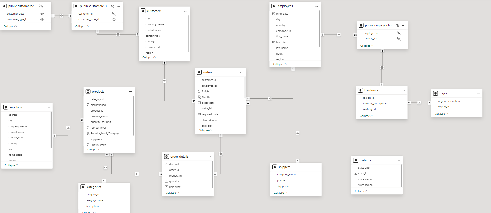
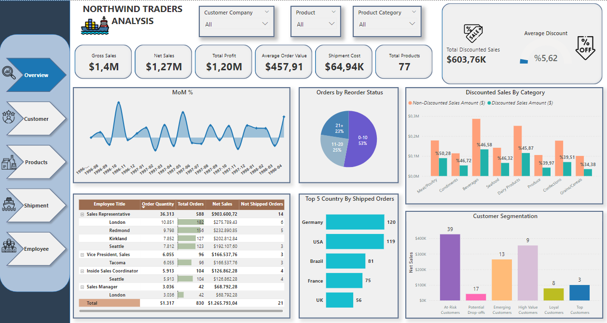
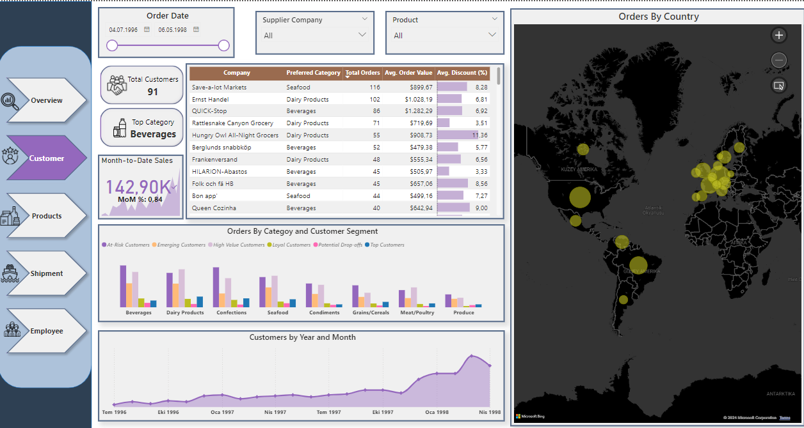
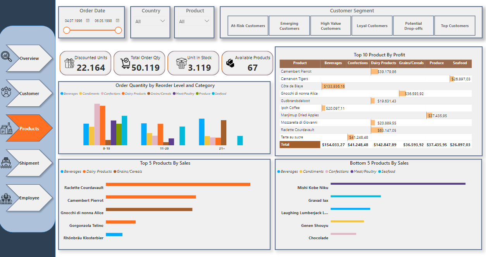
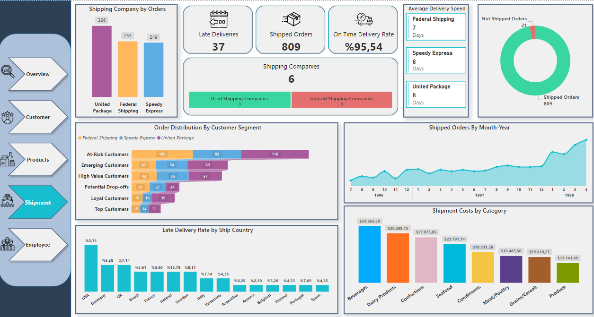
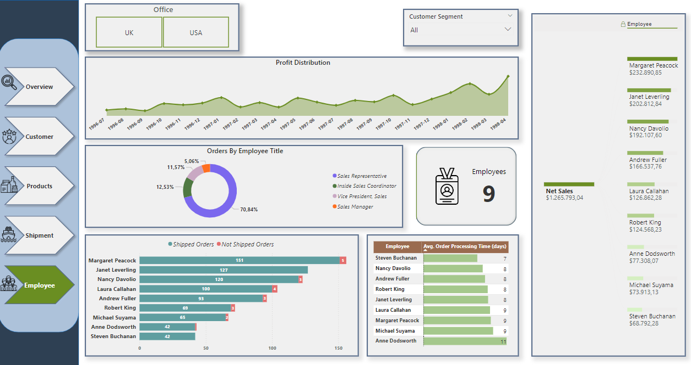

# 📊 Northwind Traders Analysis 

## Introduction
This project explores the Northwind Traders dataset, a widely used simulated business database provided by Microsoft. It represents a fictional company that imports and exports a variety of food products globally.  

The primary goal is to extract actionable insights to guide decision-making in areas such as customer behavior, sales performance, shipping efficiency, and employee productivity. By analyzing relationships within the dataset, trends and opportunities for improvement have been identified.

## 📂 Dataset Overview
The dataset encompasses multiple aspects of business operations, including customer orders, product details, employee activities, and shipping logistics. Key objectives of this project include deriving insights to help teams optimize processes and improve overall efficiency.

### Key Variables
- **Customers**: Client details, including locations and contact information.
- **Products**: Information on goods sold, such as categories and prices.
- **Categories**: Classification of products into distinct groups.
- **Employees**: Roles, activities, and reporting structure.
- **Orders & Order Details**: Sales transactions and the products involved.
- **Shippers**: Details of companies managing order fulfillment.

### Entity-Relationship Diagram (ERD)
The following diagram illustrates the structure and relationships between the tables in the dataset. It serves as a roadmap for understanding how the data is interconnected.

## 🛠 Tools Used
- **PostgreSQL**: For data extraction, transformation, and analysis.
- **Python**: For advanced analysis and visualization using libraries like pandas, matplotlib, and seaborn.
- **Power BI**: To create interactive, dynamic dashboards summarizing key insights for different departments.

## 🎯 Project Objectives
1. **Sales Performance Analysis**: Explore seasonal trends, regional sales, and top-performing categories.
2. **Customer Segmentation**: Group customers by purchasing behavior to improve targeting.
3. **Product Profitability**: Assess product performance by considering sales, discounts, and returns.
4. **Shipping Efficiency**: Analyze shipping costs and delays to enhance operations.
5. **Employee Productivity**: Measure contributions and identify areas for improvement.

## 🖥 Project Insights & Analysis
The analysis leverages a dynamic and interactive Power BI dashboard, showcasing key insights across different business areas such as sales performance, customer segmentation, product profitability, shipping efficiency, and employee productivity. Each section integrates SQL queries and Python-based analytics to deliver actionable insights, supplemented by detailed visuals for a holistic understanding of the business data.

Below is a detailed breakdown of the insights provided in the Power BI dashboard:

### Key Metrics
The dashboard summarizes the following key metrics:
- **Gross Sales**: $1.4M
- **Net Sales**: $1.27M
- **Total Profit**: $1.20M
- **Average Order Value**: $457.91
- **Shipment Cost**: $64.94K
- **Total Products**: 77

Key insights from this page:
- **Orders by Reorder Status**: 53% of the orders are placed without any reordering, indicating a strong base of new customers. However, the data also suggests significant opportunities in nurturing loyalty.
- **Discounted Sales by Category**: Categories like "Seafood" and "Produce" have higher discounted sales, signaling potential areas to optimize pricing or promotion strategies.
- **Top 5 Countries by Shipped Orders**: Germany and the USA are leading in shipments, while the UK and France show growth potential with fewer orders but substantial room for expansion.
This page serves as a summary, with deeper analysis available in the following sections.

## 📋 Customer Behavior

Click to expand

- **Order Status Analysis**: 53% of orders are placed without reordering, suggesting a healthy influx of new customers. However, opportunities exist to increase customer loyalty by encouraging repeat purchases.
- **Geographic Insights**: Germany and the USA lead in shipments, indicating strong performance in these regions. The UK and France show potential for growth, with fewer orders but opportunities for expansion.
- **Customer Segmentation**: Using RFM analysis, customers are grouped into segments like “Top Customers” and “At-Risk Customers.” These insights help prioritize retention strategies and identify high-value opportunities.

## 📦 Product Insights

Click to expand

- **Discount Analysis**: Categories like “Seafood” and “Produce” heavily depend on discounts to drive sales. Beverages, while also benefiting from discounts, demonstrate consistent demand.
- **Top vs. Bottom Performers**: The most profitable products include "Raclette Courdavault" and "Côte de Blaye," while items like "Mishi Kobe Niku" fall among the least-performing, requiring targeted promotional strategies.

## 🚚 Shipping and Logistics

Click to expand

- **Efficiency**: Federal Shipping stands out for speed, averaging 7 days per delivery. Conversely, the USA and Germany experience the highest late delivery rates, highlighting areas for process improvements.
- **Cost Analysis**: Shipping costs are highest for "Beverages" and "Dairy Products," while "Produce" and "Grains/Cereals" incur lower expenses.

## 👥 Employee Productivity

Click to expand

- **Performance Highlights**: Sales Representatives account for 70.84% of orders, demonstrating their importance to the sales pipeline.
- **Top Contributors**: Margaret Peacock leads in revenue generation, while other employees exhibit growth potential with appropriate training and support.

*📝 Note:*
*The visuals are derived from Power BI's dynamic reporting tools, enabling an interactive exploration of the data.*

## 🔑 Conclusion
This project demonstrates the power of data-driven insights to improve business processes. From analyzing customer behavior to evaluating shipping efficiency and employee productivity, each department benefits from tailored strategies grounded in this analysis.

💡 If you found this project insightful or helpful, feel free to ⭐ star this repository. Thank you for your support!
